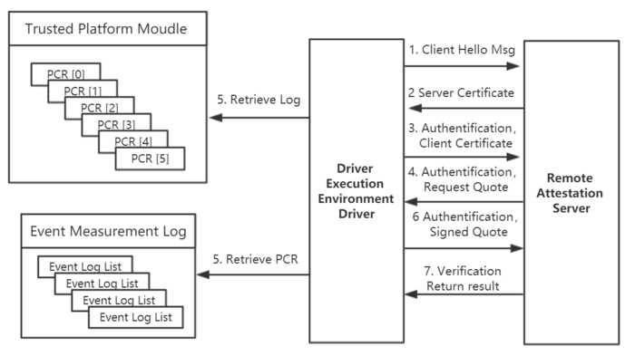

# fTPM-based-UEFI-remote-attestation

An implementation for firmware TPM and improved SSL/TLS based UEFI remote attestation

## (1) Overview
This project aims to provide simplified secure boot based on remote attestation approach for UEFI-supportive system. The UEFI Attestation framework consists of client and server side. 

<p align="center">

</p>

The client side acts as a DXE Driver which requires for network support in UEFI environment. And the server side will provide security authentication service. The connection between server and client will be established based on SSL/TLS protocol.

## (2) Installation

1. Download and configure EDKII.
`git clone https://github.com/tianocore/edk2.git`

2. Enter into path `$WorkPath/edk2` and clone
```
cd edk2
git clone https://github.com/Hecmay/UEFI-Attestation.git

```
3. Set up the Ovmf Paltform description file and QEMU

For details please refer to the followed links:
* [Secure Boot in OVMF and vTPM Configuration](https://www.jianshu.com/p/79f08434bbf0)
* [OVMF Serial port Debugging on QEMU](https://www.jianshu.com/p/7baa7c1db17f)

After setting up the network parameter and building OvmfPkg into OVMF.fd, launch `ServerSide/server.py` on a server in the same LAN, as well as the Ovmf firmware in QEMU with `Utility/boot.sh` using `source boot.sh start`.  

